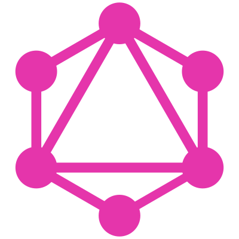

<h1 align="left" id="swestphal-title">:wave: Hello there! I'm Simone Westphal</h1>
<h3 align="left">I am a self-motivated, curious and tech-loving full-stack developer</h3>

  

 
:office: &nbsp;I'm just changing my stack from php to
    **JavaScript**
 :seedling: &nbsp;I’m currently learning **Cloud Development**
 :computer: &nbsp;Connect with me on **[LinkedIn]**

 

<h2 align="left" id="swestphal-tech">Favorite Tech</h2>

> Tools, languages, and other things that I like to work with.

<table>
  <tr>
    <td align="center" width="96">
      
       JavaScript
    </td>
    <td align="center" width="96">
      
       React
    </td>
    <td align="center" width="96">
      
       Nodejs
    </td>
    <td align="center" width="96">
      
       Sass
    </td>
    <td align="center" width="96">
      
       Mongo
    </td>
    <td align="center" width="96">
      
       GraphQl
    </td>
    <td align="center" width="96">
      
       MySQL
    </td>
  </tr>
</table>

<!-- links -->

[issues page]: https://github.com/swestphal/swestphal/issues 'swestphal/issues'
[linkedin]: https://www.linkedin.com/in/simonewestphal/ 'Simone Westphal LinkedIn'
# swestphal
